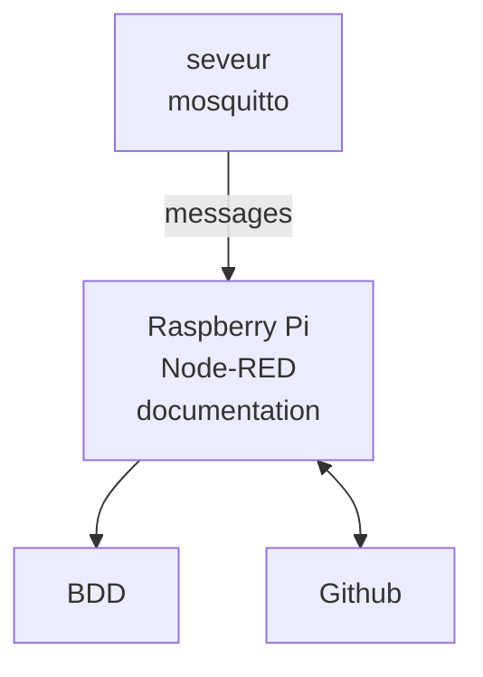

# test-univ-tours

Projet test pour montrer l'utilisation 

ce que le projet va \*\*permettre\*\* :

* Récupérer les messages
* Les stocker en BDD
* Les afficher
* Utiliser Node-RED

Ajouter une image : 

